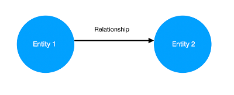

# Create Knowledge Graphs from text

A **Knowledge Graph** is a set of data points connected by relations that describe a domain, for instance, a business, an organization, or a field of study. It is a powerful way of representing data because Knowledge Graphs can be built automatically and can then be explored to reveal new insights about the domain.

The concept of Knowledge Graphs borrows from the Graph Theory. In this particular representation, we store data as:

Useful information can be found in https://www.kaggle.com/code/pavansanagapati/knowledge-graph-nlp-tutorial-bert-spacy-nltk

Entity 1 and Entity 2 are called nodes and the Relationship is called an edge. Of course, in a real-world knowledge graph, there are lots of entities and relationships and there is more than one way to arrive at one entity starting from another.

Usually, these types of graphs is modeled with triples, which are sets of three items like (subject, verb, object), with the verb being the relationship between the subject and the object - for example (London, is_capital, England).

 
 

## Implementations/Notebooks
---

1. Basic information about the development of Knowledge Graphs from text
2. Create knowledge graph from sentences using spaCy library
3. Create knowledge graph from text using REBEL model (HuggingFace). Additionally, we provide an implementation of *Entity Linking* procedure in which two entities should be treated as the same ie. "Napoleon" and "Napoleon Bonaparte".

 
 

## Useful links
---

- https://www.kaggle.com/code/nageshsingh/build-knowledge-graph-using-python
- https://neptune.ai/blog/web-scraping-and-knowledge-graphs-machine-learning
- https://www.analyticsvidhya.com/blog/2019/10/how-to-build-knowledge-graph-text-using-spacy/
- https://medium.com/nlplanet/building-a-knowledge-base-from-texts-a-full-practical-example-8dbbffb912fa
- https://blog.vsoftconsulting.com/blog/how-to-build-a-knowledge-graph?hs_amp=true
- https://www.kaggle.com/code/pavansanagapati/knowledge-graph-nlp-tutorial-bert-spacy-nltk

 
 

## Contact
---

Ioannis E. Livieris (liviers@gmail.com)